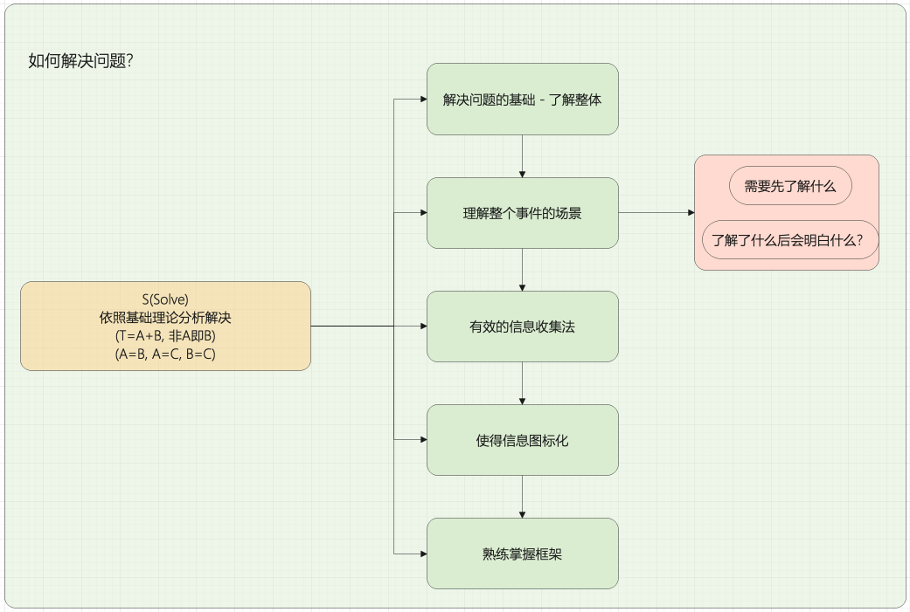

# 读书笔记
```
    逻辑思考是解决问题的工具
```

解决问题的第一步是发现正确的问题, 只有正确的问题，才会有有效的解法
```
    数据的收集和分析，提取真正的问题;
    正确的表述问题;
```

解决问题的核心是寻找本质
```
    寻找出本质问题，反复对问题提出质疑，直到找到问题的本质。
    解决问题的步骤不是找到本质问题=>解决问题。而是找到本质问题=>思考解决方案=>考虑实施方法。
```


复杂的事情都能从最基本的理论推理得到。
```
两个基本的理论:
A=B, A=C, B=C
T=A+B, 非A即B
```

PSA逻辑思考法
```
P是问题(Problem),S是解决(Solving),A是探索(Approach)
原则1:所有的问题都能解决。
原则2:时常思考whatif..., 即"如果存在问题的答案，答案会是在什么范围？答案会是什么?"
    1) 使得可能性加起来为100%. - 想问题要全面
    2) 按照可能性大小，所有可能性进行排除，确定范围
    3) 收集证据，验证假设，直到解决问题。
原则3:这个问题的本质是什么？
```
PSA逻辑思考法:


解决问题模块扩展:


PREP逻辑表达法
```
Point: 先陈述观点
Reason: 说明观点和理由
Example: 举例说明上述观点和理由，必要时采用比喻。
Point: 复述观点和理由，确保观点传达正确。

写作，梳理书的目录也是一个训练逻辑思维比较好的方式。
```

