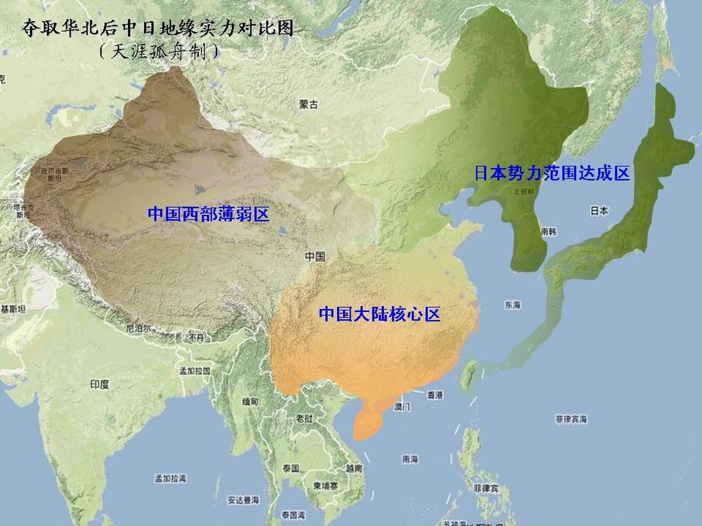

# 梳理关于第二次世界大战的世界格局

## 日中战争

关于日本占领中国的策略
```
1. 占领华北后，日本有"鲸吞"和"蚕食"两种政策，但蚕食对于日本来说是更好的一种策略。但南京方面意识到了这一点，故调动精锐
大举进攻上海，虽然3个月后惨败，但激怒了日本。随即开始进攻南京。开始了"鲸吞"策略。37年南京，民国政府迁驻汉口，38年日本
进攻武昌，民国政府迁驻重庆。因为攻击首都的行为和南京大屠杀，此时的战争就变得不可控了。此时南京政府向西转移，此时格局已经
由北向南变成由东向西。

```
日军蚕食策略到鲸吞策略的转变:
```
1. 没达到绥远和内蒙古不是因为战略上不打，而是因为打了，没打过(当时有苏联)。
```


蚕食策略图


为什么会有南京大屠杀？
```
1. 想瓦解中国人的意志。 一种说法我觉得非常有道理，日本民族是刚性的，军事反抗精神非常强烈，宁死不屈，但一旦被政府就会死心塌地
的归顺。
```

