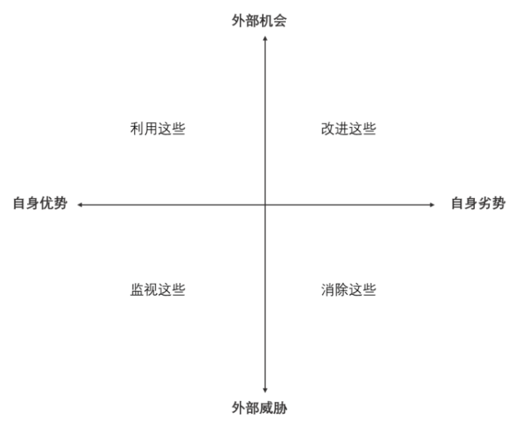

# 《木桶定律》思考笔记
## "奥尔森定律"
```
每个国家的灾难都会相互重复。因此研究朝代的灭亡或者失败，应该是一个很有意思的事情。
```

## 研究"人"的失败
```
研究一个人的"功"与"过"也是一个很有意思的事情。
```

## 人关于"高质量"生活的木桶效应
```
分析我目前的"木桶效应"？
```

## 系统理论
```
系统的优劣取决于子系统的优劣以及子系统的相互关系。比如说木桶效应不仅取决于各个板的高低，也取决于
板间的联系，即粘合程度。
```

## 临界点效应
```
99摄氏度的水并不能驱动蒸汽机，而添一把火，100摄氏度的水立刻就能出现大量的水蒸气，从而驱动蒸汽机。

因此做不好小事的人，是很难做成大事的。坚持做好小事到一定程度，"大事"只是水到渠成。
```

## 木桶效应
```
木桶效应其实最重要的就是"发现短板"，"解决短板"的过程。


发现短板的方法 -  SWOT方法
S(strength 优势) W(weakness 弱势) O(oppotunity 机会) T(treat 威胁)

解决短板的方法 
自身思考 + 借助外部的智慧
```



