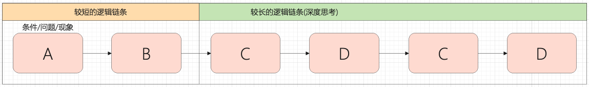
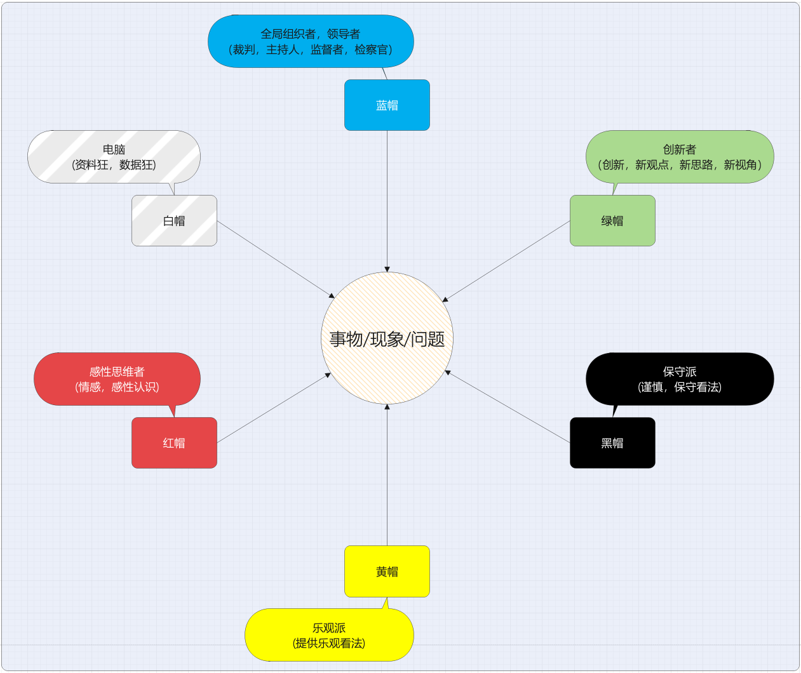
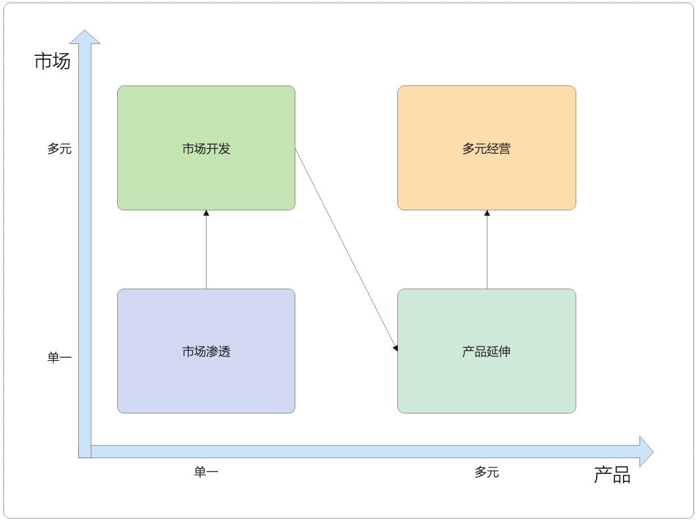

# 收获
## 思维技术
### 思维逻辑链
```
    前溯后追，逻辑链条代表了思维的深度。
```

#### 5why思考法
```
    针对一个现象，不断的追问现象产生(有意义的方向)的深层原因，直到问题变得没有意义。
```
#### 5so思考法
```
    针对一个现象，不断的追问现象产生的结果，以探求其对未来造成的深远影响。
```
### 换位思维
```
    从非己的角度去看同一个问题(基础是有共性的环境和共同的认知)，以此为起点展开推论和行动。
```
#### 六顶思考帽
```
    自己创造智囊团来思考同一个问题。
```


### 可视化思维
```
    将各种信息，以看得见的形式集中存储在某个平面，代替纯粹的大脑思考，以方便分析问题。
```
#### 矩阵分析法
```
    艾森豪威尔矩阵: 分析众多事情的优先级。
```

```
    安索夫矩阵: 分析战略，人生规划等
```


#### 仪表盘分析法
```
    借鉴仪表盘的设计思想，来管理多样的，复杂的事情及规划。
```


### 流程思维

## 思维格局
### 生态思维
### 系统思维
### 大势思维
### 兵法思维